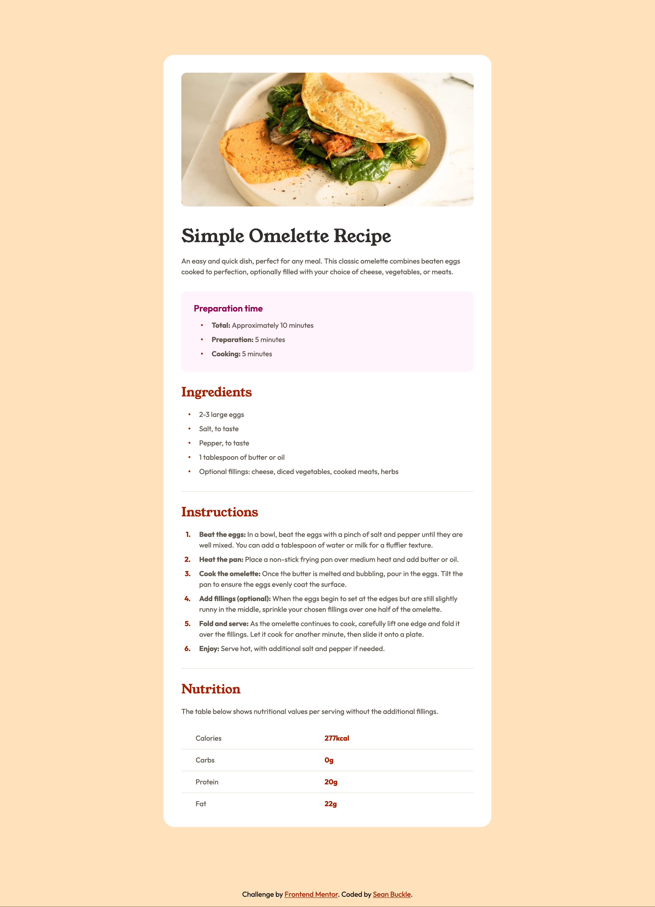

# Frontend Mentor - Recipe page solution

This is a solution to the [Recipe page challenge on Frontend Mentor](https://www.frontendmentor.io/challenges/recipe-page-KiTsR8QQKm). Frontend Mentor challenges help you improve your coding skills by building realistic projects. 

## Table of contents

- [Overview](#overview)
  - [The challenge](#the-challenge)
  - [Screenshot](#screenshot)
  - [Links](#links)
- [My process](#my-process)
  - [Built with](#built-with)
- [Author](#author)

## Overview

### Screenshot

### Links

- Solution URL: [https://github.com/seanbuckle/recipe-page](https://github.com/seanbuckle/recipe-page)
- Live Site URL: [https://seanbuckle.github.io/recipe-page/](https://seanbuckle.github.io/recipe-page/)

## My process

### Built with
- [Semantic HTML5 markup](https://developer.mozilla.org/en-US/docs/Web/HTML)
- [CSS custom properties](https://developer.mozilla.org/en-US/docs/Web/CSS/Using_CSS_custom_properties)
- [CSS Grid](https://developer.mozilla.org/en-US/docs/Web/CSS/CSS_Grid_Layout)
- Mobile-first workflow
- [SASS/SCSS](https://sass-lang.com/)
- [Container Queries](https://developer.mozilla.org/en-US/docs/Web/CSS/CSS_container_queries)

## Author
- Frontend Mentor - [@seanbuckle](https://www.frontendmentor.io/profile/seanbuckle)
- Twitter - [@seanlbuckle](https://www.twitter.com/seanlbuckle)
- LinkedIn - [@seanbuckle](https://www.linkedin.com/in/seanbuckle/)